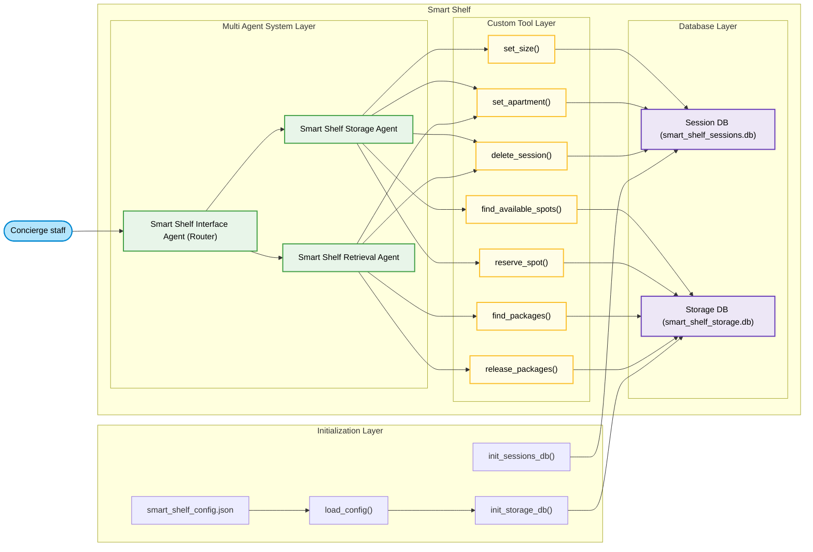

# Smart Shelf

### AI Co-Pilot for Concierge Desks – Zero Errors, Zero Double-Bookings

A lightweight and efficient AI-powered concierge assistant that replaces paper logs and chaotic messaging systems with a single chat window. It understands natural language commands like <i>"Store a large package for apartment 27"</i> or <i>"Pick up packages from apt 12"</i>, and routes requests to specialized agents, streamlining the package management process for high-rise buildings and concierge teams.

## The Problem

In high-rise buildings, concierge teams often face the challenge of managing package storage and retrieval through outdated systems like paper logs or messaging apps. This leads to inefficiencies, lost packages, confusion, and delays in service. There's a need for a more streamlined, reliable, and automated system to manage this process.

## The Solution

Our AI-powered concierge assistant eliminates the chaos of paper logs and messaging systems. It allows staff to interact with the system using natural language commands such as <i>“Store a large package for apartment 27”</i> or <i>“Pick up packages from apt 12.”</i> The system automatically handles both storing and retrieving packages using two specialized agents, ensuring that all tasks are completed quickly and reliably with no double bookings and zero errors.

## Features

SmartShelf succeeds by making LLM-powered agents the primary interface instead of a bolt-on chatbot.

- **Natural Language Understanding**: The system interprets commands like <i>"Store a large package for apartment 27"</i> or <i>"Pick up packages from apt 12"</i>
  without requiring specific formats or technical knowledge.

- **Multi Agent System**:

  - **SmartShelfInterfaceAgent**: Serves as a fast, reliable router that directs requests to either the `SmartShelfStorageAgent` or the `SmartShelfRetrievalAgent` based on the user’s input.

  - **SmartShelfStorageAgent**: Handles finding storage shelf and storing, ensuring smooth and reliable package storage management.

  - **SmartShelfRetrievalAgent**: Manages package retrieval, handling all steps from finding stored packages to confirming successful releases.

- **Zero Hallucination**: The agents operate with hyper-focused prompts, ensuring accurate and predictable responses with minimal risk of errors (hallucinations).

- **Tools**: Custom tools that interact with the SQLite database to perform essential functions like finding available lockers and reserving spots. These tools ensure data integrity and consistency.

- **Atomic Database Operations**: All database operations (like booking and releasing lockers) go through four atomic functions, ensuring zero double-bookings even in a multi-user environment.

- **Observability**: **LoggingPlugin** provides an automatic and transparent audit trail.

- **Session Management**:
  - **Sessions**: The system uses InMemoryRunner for a single persistent session, a fixed session ID (`concierge_desk`) and a dedicated `smart_shelf_sessions.db` file. This means the entire concierge team — no matter how many people are typing — shares one coherent “brain.” There is never confusion about which conversation belongs to which staff member.
  - **Clean State Management**: The `delete_session_tool` is called only after a successful storage or retrieval, guaranteeing that abandoned or half-finished bookings never clog the system.

This is not “ChatGPT + a database.” It is a deliberate multi-agent hierarchy where LLMs are bounded by tools and strict instructions—exactly the pattern required for production-grade enterprise reliability.

## Tech Stack

- **Language**: Python

- **Database**: SQLite (dual file database)

- **AI Model**: Google Gemini 2.5 Pro for language understanding and agent interaction

- **AI Framework**: Google ADK (Agent Development Kit)

## Architecture Overview



## Getting Started

- **No LLM ever touches the database directly** → eliminates hallucinations & race conditions
- All state stored in a tiny `smart_shelf_sessions.db`
- Shelf layout defined once in `smart_shelf_config.json`
- Full conversation history & tool calls logged automatically

### Prerequisites

To run this system, you’ll need:

- Python 3.7+
- SQLite3 (embedded database used for storage management)
- Access to a suitable LLM model (e.g., Gemini 1.5 Pro)

### Installation

1. Clone the repository:

   ```bash
   git clone https://github.com/scc2392/smart-shelf.git
   ```

cd concierge-ai

2. Install dependencies:

   ```bash
   pip install google-adk-python

   ```

3. Get a Gemini API key

   ```bash
   export GEMINI_API_KEY="your-key-here"

   ```

4. Set up the SQLite database and configuration files:

- Create the smart_shelf_config.json file in src folder.
- Adjust the smart_shelf_config.json file to match your building’s storage shelf layout.

  - The `smart_shelf_config.json` file should look like:

    ```json
    {
      "storage_space_details": [
        { "spot_id": "A1", "size": "S", "location": "Lobby Left" },
        { "spot_id": "A2", "size": "M", "location": "Lobby Left" },
        { "spot_id": "B1", "size": "L", "location": "Back Hall" },
        { "spot_id": "B2", "size": "S", "location": "Back Hall" }
      ]
    }
    ```

- Running the system

  ```bash
  python3 src/main.py
  ```

- Ensure that the smart_shelf_storage.db file is created and populated with the storage shelf layout data.
- Ensure that the smart_shelf_sessions file is created and populated with session data.
- Once the system starts, it will be ready to interact with the concierge staff through a natural language interface.

#### Example Usage

##### Storing a package:

_Concierge staff input:_ Store a small package for apartment 12

The system finds an available storage shelf for a large package and reserves it for apartment 12.

##### Retrieving a package:

_Concierge staff input:_ Pick up packages from apt 12

The system finds all the stored package for apartment 12 and prepares it for retrieval.

### Live Examples

#### Example1:

```text
You: Store a small package for apartment 12

Assistant: OK. I have found a spot for you in the Lobby Left, spot A1. Do you want to reserve it?

You: yes

Assistant: Excellent! Your spot is confirmed.
**Reservation Details:**
*   **Spot ID:** A1
*   **Size:** S
*   **Location:** Lobby Left
*   **Apartment:** 12

```

#### Example2:

```text
You: Pick up packages from apt 12

Assistant: OK. I found three packages for apartment 12.
*   one small package is in Lobby Left at A1
*   one medium package is in Lobby Left at A2
*   one large package is in Back Hall at B1
Do you want me to release them?

You: yes

Assistant: Your 3 packages have been released:
- Spot A1 (S) in Lobby Left
- Spot A2 (M) in Lobby Left
- Spot B1 (L) in Back Hall

```

### Contributing

Contributions are welcome to improve this project! To get started, fork the repository, make your changes, and submit a pull request.

##### Steps to contribute:

- Fork the repo and clone it locally.

- Create a new branch for your feature or bug fix.

- Install dependencies and run the application locally to test your changes.

- Submit a pull request with a detailed description of the changes.

## Closing

SmartShelf isn’t just another package tracker — it’s the AI co-pilot concierge staff trust completely and literally cannot work without.
